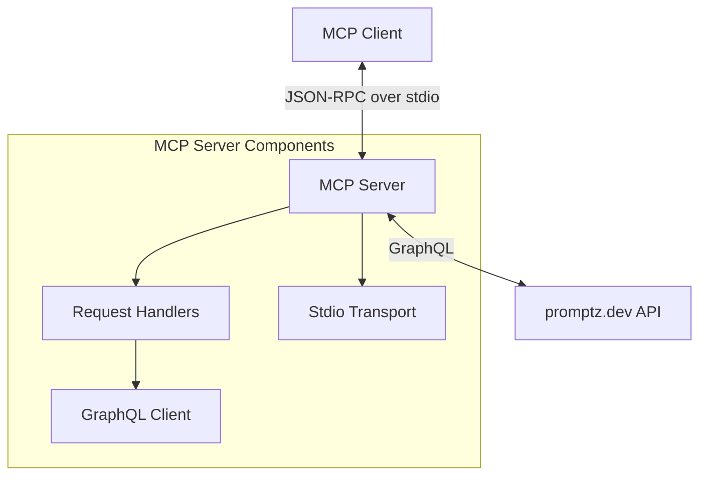

# System Patterns: promptz.dev MCP Server

## System Architecture

The promptz.dev MCP Server follows a modular architecture with clear separation of concerns:

1. **Transport Layer**: Handles communication with MCP clients using stdio (standard input/output).
2. **Server Core**: Manages the MCP protocol, request routing, and response formatting.
3. **Request Handlers**: Implement specific functionality for each MCP request type.
4. **GraphQL Client**: Manages communication with the promptz.dev GraphQL API.

## Key Technical Decisions

1. **Model Context Protocol (MCP)**: Using MCP as the communication protocol enables integration with various AI assistants that support this standard.

2. **TypeScript**: Chosen for type safety, modern JavaScript features, and excellent tooling support.

3. **GraphQL**: Used for API communication with promptz.dev, providing flexible and efficient data fetching.

4. **stdio Transport**: Using standard input/output for communication makes the server compatible with various MCP clients without requiring network configuration.

5. **Environment Variables for Configuration**: API credentials are provided via environment variables, allowing secure configuration without hardcoding sensitive information.

6. **Error Logging to stderr**: All logs are written to stderr to avoid interfering with the JSON-RPC protocol messages on stdout.

## Design Patterns

1. **Request Handler Pattern**: Each MCP request type has a dedicated handler function, making the code modular and maintainable.

2. **Dependency Injection**: The GraphQL client is created separately and used by the request handlers, allowing for easier testing and flexibility.

3. **Error Handling Middleware**: Centralized error handling ensures consistent error responses and logging.

4. **Factory Pattern**: The server creates and configures handlers for different request types.

5. **Adapter Pattern**: Converting between promptz.dev API data structures and MCP protocol structures.

## Component Relationships

### MCP Server

The core server component initializes the transport layer and registers request handlers. It's responsible for:

- Defining the server capabilities
- Setting up request handlers
- Managing the connection lifecycle
- Error handling

### Request Handlers

Four main request handlers are implemented:

1. **ListToolsRequestHandler**: Exposes the available tools to MCP clients.
2. **CallToolRequestHandler**: Executes tool requests (list_prompts, get_prompt).
3. **ListPromptsRequestHandler**: Lists available prompts as MCP prompt templates.
4. **GetPromptRequestHandler**: Retrieves a specific prompt by name.

### GraphQL Client

The GraphQL client manages communication with the promptz.dev API:

- Handles authentication with API key
- Executes GraphQL queries
- Processes API responses
- Error handling for API communication

## Data Flow

1. **Tool Discovery**:

   - MCP client requests available tools
   - Server responds with tool definitions
   - Client displays tools to the user

2. **Prompt Listing**:

   - User requests prompt list
   - MCP client calls the list_prompts tool
   - Server queries promptz.dev API
   - Server formats and returns results
   - Client displays prompts to the user

3. **Prompt Retrieval**:
   - User requests a specific prompt
   - MCP client calls the get_prompt tool with prompt name
   - Server queries promptz.dev API
   - Server formats and returns the prompt
   - Client uses the prompt

## Error Handling Strategy

1. **API Errors**: Errors from the promptz.dev API are caught, logged, and translated into appropriate MCP error responses.

2. **Configuration Errors**: Missing environment variables are detected early and result in clear error messages.

3. **Request Validation**: Input parameters are validated before processing requests.

4. **Graceful Degradation**: When possible, partial results are returned rather than failing completely.

5. **Detailed Logging**: All errors are logged with context to aid debugging.
